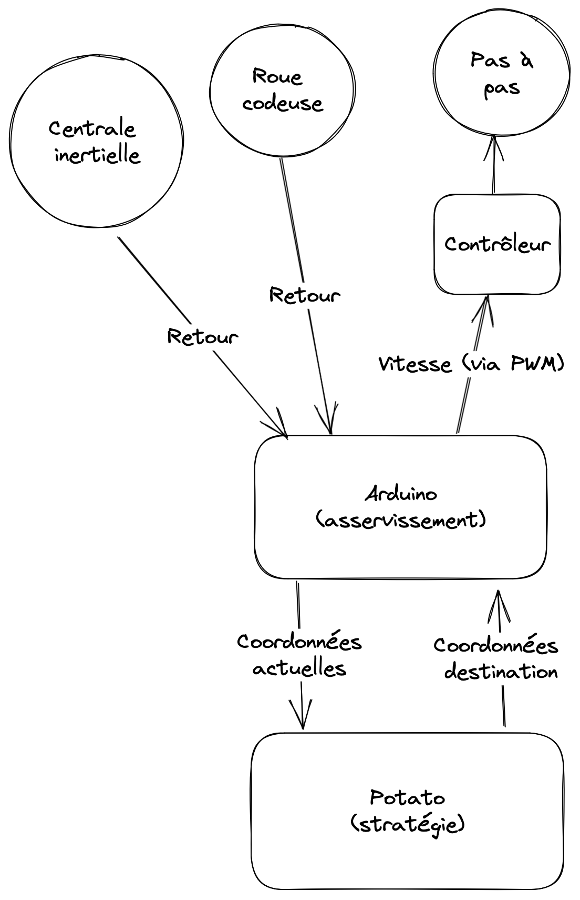

# Schéma

# Protocole de communication

- On utilise l'UART.
- Baudrate : 115200
- 8 bits par byte.
- Pas de parité
- 1 bit de stop

# Conventions de communication

L'arduino et le potato échangent régulièrement : le potato donne des ordres de position et l'arduino
renvoie à intervale régulier la position actuelle du robot.

Le format est le suivant : `x;y;θ`

Avec x, y et θ des nombres flottants.

X et Y sont en mm.
Theta est en radians.
